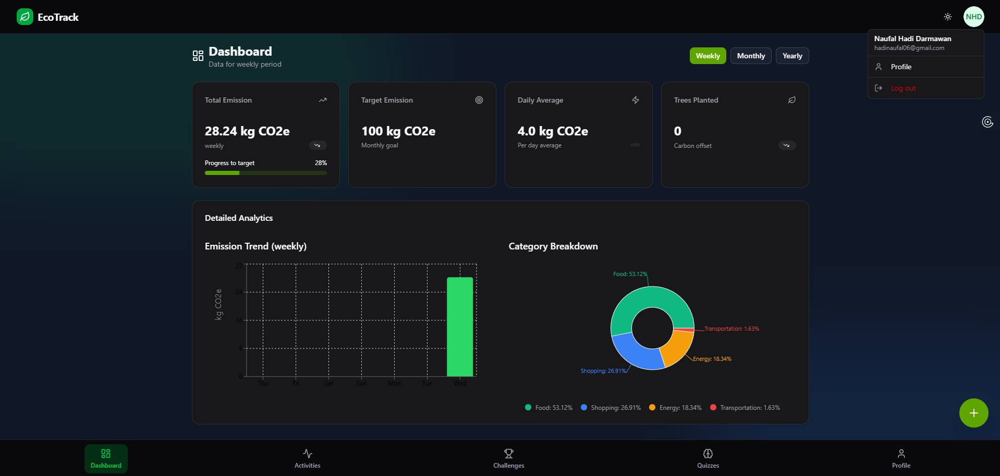
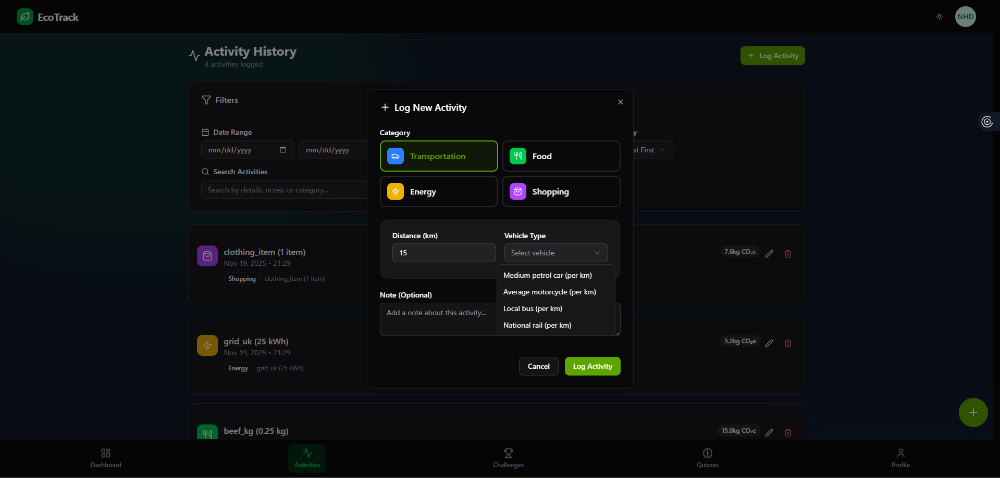
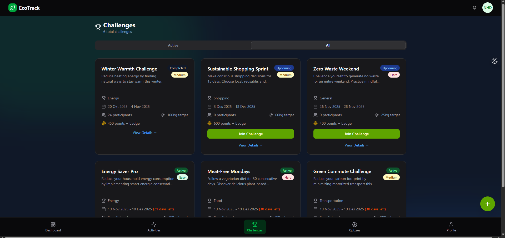
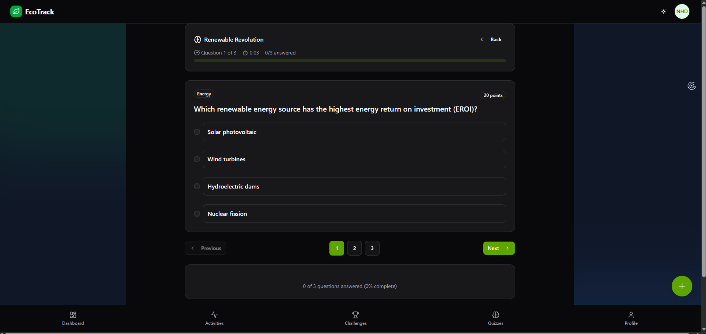

# 🌱 EcoTracker - Personal Carbon Footprint Tracker

[](https://opensource.org/licenses/MIT)
[](https://nodejs.org/)
[](https://www.mongodb.com/)

A comprehensive personal carbon footprint tracker **built with MERN Stack** that helps users monitor and reduce their environmental impact through activity logging, educational quizzes, and community challenges.

## 📸 Screenshots

| Landing Page | Dashboard | Activity Logging | Challenge | Quiz |
|-------------|-----------|------------------|-----------|------|
|  |  |  |  |  |

## ✨ Features

### 🔍 **Activity Logging**
- Track daily activities across 4 categories: Transportation, Food, Energy, Shopping
- Accurate emission calculations using DEFRA 2024 emission factors
- Detailed breakdown with carbon footprint reports
- Historical activity tracking with filtering and pagination

### 📊 **Intelligent Dashboard**
- Weekly/Monthly/Yearly emission statistics with interactive charts
- Interactive charts and category breakdowns using Recharts
- Progress tracking toward emission targets
- Tree planting equivalent visualization based on emissions
- Real-time calculation of carbon offset metrics

### 🏆 **Challenges & Leaderboards**
- Join community carbon reduction challenges
- Track progress against other participants
- Earn badges and compete for top rankings
- Join and leave challenges with progress updates

### 🎓 **Educational Quizzes**
- Interactive quizzes on climate change and sustainability topics
- Categorized by difficulty (Easy, Medium, Hard)
- Score tracking and improvement analytics
- Quiz attempts with detailed results and explanations
- Cooldown system to encourage consistent learning

### 👤 **User Experience**
- Comprehensive onboarding wizard for new users
- Responsive design with dark/light theme support using TailwindCSS
- Secure authentication with JWT and password change functionality
- Profile management and emission target setting

### 🔧 **Technical Features**
- RESTful API with comprehensive OpenAPI 3.0 specification
- Rate limiting and caching with Upstash Redis
- Input validation with Joi schemas
- Role-based access control
- Automated linting and code quality checks

## 🛠️ Tech Stack

| Category | Technology | Purpose |
|----------|------------|---------|
| **Frontend** | React 19, Vite | Modern UI framework and fast development |
| **Styling** | TailwindCSS, shadcn/ui | Responsive design with accessible components |
| **Routing** | React Router | Client-side navigation and route protection |
| **Charts** | Recharts | Data visualization for dashboard charts |
| **HTTP Client** | Axios | API communication |
| **Forms** | React Hook Form, Zod | Form validation and management |
| **Backend** | Node.js, Express | REST API server with middleware |
| **Database** | MongoDB | NoSQL data storage with Mongoose ODM |
| **Caching** | Redis (Upstash) | Session management and rate limiting |
| **Validation** | Joi | Server-side input validation |
| **Security** | JWT, bcryptjs | Authentication and secure passwords |
| **Development** | ESLint, ESLint Google Config | Code quality and standards |

## 🚀 Getting Started

### Prerequisites
- Node.js 18 or higher
- MongoDB 7 or higher (local or Atlas)
- Upstash Redis account for caching
- npm or yarn package manager

### Installation

1. **Clone the repository**
   ```bash
   git clone https://github.com/your-username/eco-tracker.git
   cd eco-tracker
   ```

2. **Backend Setup**
   ```bash
   cd backend
   npm install
   ```

3. **Frontend Setup**
   ```bash
   cd ../frontend
   npm install
   ```

4. **Environment Configuration**

   Create `.env` file in `backend/` directory:
   ```bash
   NODE_ENV=development
   PORT=5000
   MONGODB_URI=mongodb://localhost:27017/ecotracker
   JWT_SECRET=your-super-secret-jwt-key-here
   UPSTASH_REDIS_REST_URL=https://your-upstash-instance.upstash.io
   UPSTASH_REDIS_REST_TOKEN=your-upstash-token
   ```

   **Environment Variables Explanation:**
   - `NODE_ENV`: Environment setting (development/production)
   - `PORT`: Server port (default: 5000)
   - `MONGODB_URI`: MongoDB connection string (local or cloud)
   - `JWT_SECRET`: Secret key for JWT token signing (use strong random string)
   - `UPSTASH_REDIS_REST_URL`: Upstash Redis REST API URL
   - `UPSTASH_REDIS_REST_TOKEN`: Upstash Redis authentication token

5. **Start Backend Server**
   ```bash
   cd backend
   npm run dev
   ```
   Backend will start on http://localhost:5000

6. **Start Frontend Development Server**
   ```bash
   cd ../frontend
   npm run dev
   ```
   Frontend will start on http://localhost:5173

7. **Build for Production** (Optional)
   ```bash
   # Frontend build
   cd frontend
   npm run build

   # Backend doesn't need building, use npm run start
   cd ../backend
   npm run start
   ```

## 📋 API Documentation

Complete API documentation is available via OpenAPI 3.0 specification:
- **Swagger UI**: http://localhost:5000/api-docs (when running backend)
- **OpenAPI JSON**: http://localhost:5000/api-spec.yaml

### Main API Endpoints:

| Endpoint | Method | Description |
|----------|--------|-------------|
| `/auth/login` | POST | User authentication |
| `/auth/register` | POST | User registration |
| `/activities` | GET/POST | Activity management |
| `/dashboard` | GET | Dashboard data and statistics |
| `/challenges` | GET/POST | Challenge system |
| `/quizzes` | GET/POST | Quiz management and attempts |
| `/profile` | GET/PUT | User profile operations |
| `/factors` | GET | Emission factors data |
| `/onboarding` | GET/POST | User onboarding flow |

## 🧪 Testing

### API Testing
Include Postman collection in `backend/postman-test/` directory:
- EcoTrack Authentication.postman_collection.json
- EcoTrack Activities.postman_collection.json
- EcoTrack Challenges.postman_collection.json
- EcoTrack Dashboard.postman_collection.json
- EcoTrack Factors.postman_collection.json
- EcoTrack Onboarding.postman_collection.json
- EcoTrack Quiz.postman_collection.json

### Frontend Testing
```bash
cd frontend
npm run lint     # Lint code
npm run preview  # Preview production build
```

## 🤝 Contributing

We welcome contributions! Please follow these steps:

1. Fork the repository
2. Create a feature branch (`git checkout -b feature/amazing-feature`)
3. Commit your changes (`git commit -m 'Add some amazing feature'`)
4. Push to the branch (`git push origin feature/amazing-feature`)
5. Open a Pull Request

### Code Style
- Follow ESLint configuration in both backend and frontend
- Use meaningful commit messages
- Write clear documentation for complex features
- Add tests for new functionality

## 📄 Project Structure

```
eco-tracker/
├── backend/                     # Express.js API server
│   ├── src/
│   │   ├── controllers/         # Route handlers
│   │   ├── models/              # MongoDB schemas
│   │   ├── routes/              # API route definitions
│   │   ├── middleware/          # Express middleware
│   │   ├── utils/               # Utility functions
│   │   ├── validator/           # Joi validation schemas
│   │   └── server.js            # Main server file
│   ├── postman-test/            # Postman collections
│   └── api-spec.yaml            # OpenAPI specification
├── frontend/                    # React SPA
│   ├── src/
│   │   ├── components/          # Reusable UI components
│   │   ├── pages/               # Page components
│   │   ├── hooks/               # Custom React hooks
│   │   ├── contexts/            # React contexts
│   │   └── services/            # API service functions
│   ├── public/                  # Static assets
│   └── screenshots/             # Screenshot images (to be added)
├── README.md                    # This file
└── .gitignore                   # Git ignore rules
```

## 📄 License

This project is licensed under the MIT License - see the [LICENSE](./LICENSE) file for details.

## 👥 Acknowledgments

- **DEFRA 2024**: Emission factors data source
- **Upstash**: Redis hosting service
- **OpenAPI Initiative**: API documentation standard
- **radix-ui**: Accessible UI components

## 📞 Support

For questions or support:
- Create an issue on GitHub
- Review the API documentation
- Check the Postman collections for API examples

---

*Made with ❤️ for a more sustainable future*
